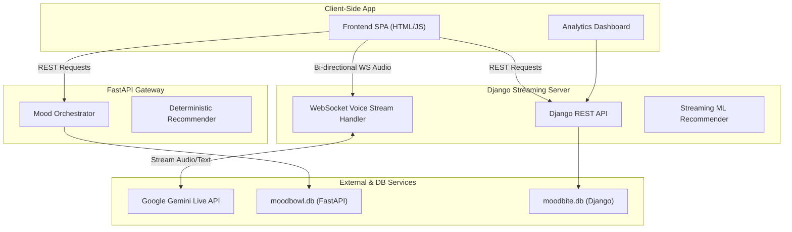

# 🍲 MoodBowl — Eat What You Feel

MoodBowl is a state-of-the-art, mood-aware food recommendation and ordering platform. By merging text analysis, speech transcription, and real-time voice streaming, MoodBowl tailors your dining choices to your current emotional state.

---

## 🏗️ System Architecture

MoodBowl is structured into two main components:
1. **Core API Gateway & Orchestrator (FastAPI):** Handles deterministic recommendations, session storage, and persistent database logic.
2. **Streaming & Frontend Host (Django & WebSockets):** Serves the full Single Page Application (SPA), hosts the live streaming analytics dashboard, and orchestrates live audio streaming sessions with the **Gemini Live API** via bi-directional WebSockets.



---

## 📂 Project Structure

*   **[`backend/`](file:///c:/Users/shrad/Downloads/moodbite/backend):** FastAPI backend.
    *   **[`app/services/orchestrator.py`](file:///c:/Users/shrad/Downloads/moodbite/backend/app/services/orchestrator.py):** Main coordination service integrating text analysis and LLM calls.
    *   **[`static/`](file:///c:/Users/shrad/Downloads/moodbite/backend/static):** Static assets and alternative chat UI elements.
*   **[`live-streaming/`](file:///c:/Users/shrad/Downloads/moodbite/live-streaming):** Django backend and main frontend app (git submodule).
    *   **[`templates/app.html`](file:///c:/Users/shrad/Downloads/moodbite/live-streaming/templates/app.html):** Core Single Page Application (SPA) container.
    *   **[`static/js/app.js`](file:///c:/Users/shrad/Downloads/moodbite/live-streaming/static/js/app.js):** Frontend SPA application logic (API integration, audio capturing, live WebSocket connection).
    *   **[`apps/voice_ai/websocket_handler.py`](file:///c:/Users/shrad/Downloads/moodbite/live-streaming/apps/voice_ai/websocket_handler.py):** Direct real-time ASGI WebSocket server facilitating bidirectional voice-to-voice streaming with the Gemini Live API.

---

## 🛠️ Environment Configuration

Create a `.env` file in the project root directory and define the following variables:

```ini
# Google Gemini API Key (Required for Live Voice AI & Orchestrator)
GOOGLE_GEMINI_API_KEY="your-gemini-api-key-here"

# Database Configuration (for FastAPI)
DATABASE_URL="sqlite:///moodbowl.db"

# Redis Configuration (Optional for production caching/sessions)
REDIS_URL="redis://localhost:6379/0"
```

---

## 🚀 Setup & Launch Guide

### 1. Set Up the FastAPI Backend

1.  Open a terminal and navigate to the `backend/` directory:
    ```powershell
    cd backend
    ```
2.  Create and activate a virtual environment:
    ```powershell
    python -m venv venv
    # Windows:
    .\venv\Scripts\activate
    # macOS/Linux:
    source venv/bin/activate
    ```
3.  Install dependencies:
    ```powershell
    pip install -r requirements.txt
    ```
4.  Seed the FastAPI SQLite database:
    ```powershell
    python -m app.seed
    ```
5.  Start the FastAPI Server:
    ```powershell
    uvicorn app.main:app --port 8080 --reload
    ```
    *Access Swagger documentation at:* `http://localhost:8080/docs`

---

### 2. Set Up the Django Streaming & Frontend Server

1.  Open a new terminal and navigate to the `live-streaming/` submodule folder:
    ```powershell
    cd live-streaming
    ```
2.  Install dependencies:
    ```powershell
    pip install -r requirements.txt
    ```
3.  Run migrations and seed the Django SQLite database:
    ```powershell
    python manage.py migrate
    python manage.py seed_data
    ```
4.  Start the Django ASGI development server:
    ```powershell
    python manage.py runserver 8000
    ```

---

## 🔗 How to Use the App

Open your browser and navigate to:
👉 **[http://localhost:8000/app/](http://localhost:8000/app/)**

### 👥 Demo Login Credentials
*   **Email:** `user1@moodbite.demo`
*   **Password:** `demo1234`
*   *(Or click "Continue as Guest")*

### 🎙️ AI Voice Chat Feature
1.  Navigate to the Voice tab inside the app.
2.  Click **"Connect Live AI Assistant"** (Bito Live Waiter).
3.  Grant microphone permissions.
4.  Talk to Bito directly! Your voice is streamed in real-time, and Bito replies with immediate voice feedback, recommending food matching your vibe.
    *   *Note: If no `GOOGLE_GEMINI_API_KEY` is provided, Bito will run in an interactive local Mock Mode to demonstrate the full workflow.*

---

## 📊 Analytics Dashboard
Visit the live dashboard to visualize order metrics, mood distributions, and model performance:
👉 **[http://localhost:8000/dashboard/](http://localhost:8000/dashboard/)**
